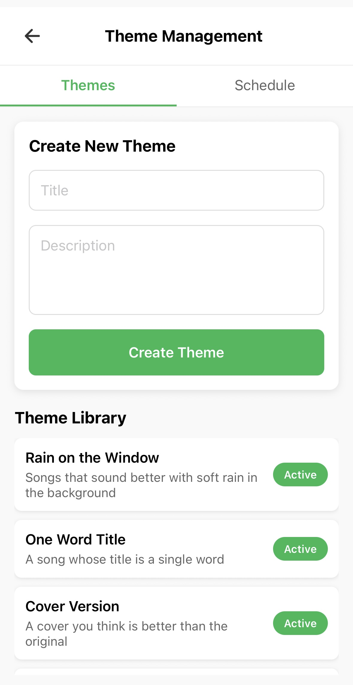

# Decipals - Daily Social Music Discovery

A social mobile application that encourages daily music discovery. Users share one song per day, with the feed locked until they participate, creating an engaging social experience. Built with React Native on the client and a Node/Express API hosted in Azure App Service, Decipals stores data in Azure Database for PostgreSQL and profile images in Azure Blob Storage. CI/CD is managed via GitHub Actions for seamless deployment.

This is a copy repo just for the purpose of showcasing the main features and architecture of the app.

## App Concept & Core Features
**Decipals** revolves around a single, playful rule: *share one track today to unlock your friends' posts*.
This constraint turns music discovery into a daily, shared ritual instead of an endless scroll.

| Area | Details |
|------|---------|
| **Daily feed-lock** | The feed resets at midnight. Until you post, the feed is locked and you can only see the theme of the day. After posting, the feed unlocks to show friends' posts. |
| **Themes** | An optional admin-scheduled prompt - e.g. “90s Guilty Pleasure” or "Last Track on a Debut Album” - shows on the lock screen - keeps things diversified |
| **Song post flow** | Search Spotify - pick track - add a note (optional) - **POST**. A successful `/daily-post` response immediately flips `feedLocked = false` on the client. |
| **Social layer** | Likes, threaded comments, friend requests, profile viewing, top-tracks carousel. Push notifications fire for every social event. |
| **Profiles** | Profile pictures, custom username, display up to top 10 most listened tracks on Spotify that month, past posts with “hide from profile” toggle. |

---

## Technical Highlights
| Tier | Key points |
|------|------------|
| **Mobile** | React Native, Context API (Auth, Feed, Notification), React Navigation (auth - feed-lock - main tabs). APNs token-based push for iOS. |
| **Backend** | Node + Express, node-cron, JWT auth, Multer for images, `@azure/storage-blob` SDK for uploads. |
| **Database** | Azure Database for PostgreSQL – Flexible Server |
| **Storage** | Azure Blob container `profile/` with public-read images (`profile/<userId>/<timestamp>.jpg`). |
| **Security** | All cloud resources sit on a private VNet; only the App Service HTTPS endpoint is public. Postgres uses a private endpoint; SSH access allowed only from a locked-down jump-box VM. |
| **App Security** | JWT auth with refresh tokens, OAuth 2.0 for Spotify, CORS configured for API security, input validation to prevent SQL injection, environment variables for sensitive data. |
| **Push Notifications** | APNs for iOS |
| **Spotify Integration** | OAuth 2.0 flow for user authentication, real-time track search, and top tracks retrieval. |
 | **CI/CD** | GitHub Actions for automated deployment to Azure App Service. |

---

## 📱 Demo

### Authentication & Onboarding

  
  

### Core User Flow

  
  
  
  

### Social Features

  
  
  
  

### Admin Features

    
    

